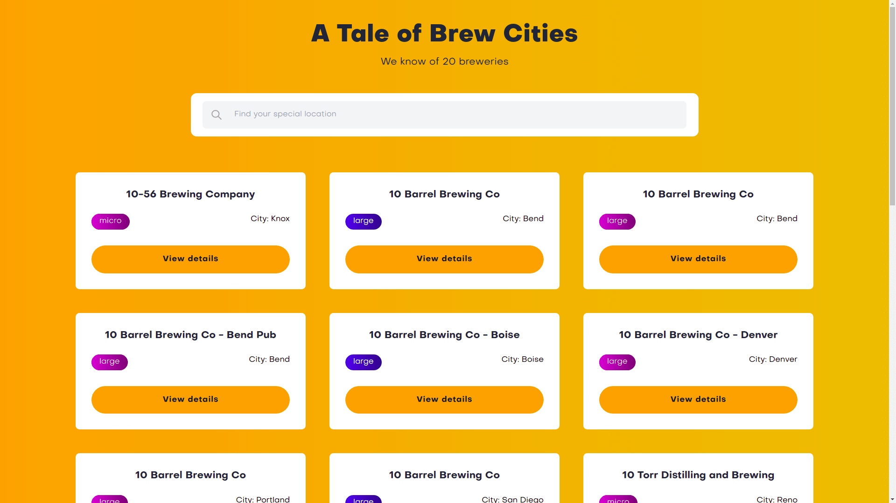

# A Tale of Brew Cities

Welcome to a Brewery API React demo. Check out your perferred pint or get outta here!



## How to run

In order to run this project, make sure to use Node 16.x and npm 8.x

For a development view, use:

```bash
npm install
npm start
```

This project was bootstrapped with [Create React App](https://github.com/facebook/create-react-app).

## Technologies used

- Typescript
- React
- React Hooks
- React Router
- TailwindCSS
- ESlint, Prettier
- Husky
- Commitlint, Commitizen
